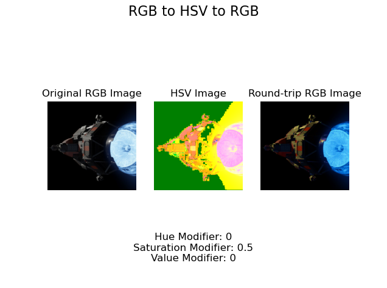

# Demonstration Script Instructions for Grader

I do not have a script with screenshots, instead, I have a program you can run in the terminal to see the output of each
of my functions.

# How to run the program

1. Open a terminal
2. Navigate to the directory where the program is located
3. Run the program with the command `python3 DEMO_SCRIPT.py <image_path>`. If no image path is provided, it will default
   to sample_square_img.png
4. The program will output the results of each of the functions

**Note: Some of the results may not be apparent in matplotlib. In that case, navigate to ./demo_output/ and look under
the respective folder**

# Expected Output

1. **RGB to HSV to RGB Conversion - (0, 0, 0) Modifiers**

   
    - The output will be saved in the ./demo_output/rgb-hsv-converter/ folder

2. **RGB to HSV to RGB Conversion - (0, 0.5, 0) Modifiers**

   
    - The output will be saved in the ./demo_output/rgb-hsv-converter/ folder

3. **RGB to HSV to RGB Conversion - (0, 0.5, 0.5) Modifiers**

   
    - The output will be saved in the ./demo_output/rgb-hsv-converter/ folder

4. **RGB to HSV to RGB Conversion - (180, 0, 0) Modifers**

   
    - The output will be saved in the ./demo_output/rgb-hsv-converter/ folder

5. **Random Cropping**

   
    - The output will be saved in the ./demo_output/random-crop/ folder

6. **Patch Extraction - (5x5)**

   
    - The output will be saved in the ./demo_output/extract-patch/ folder

7. **Patch Extraction - (10x10)**

   
    - The output will be saved in the ./demo_output/extract-patch/ folder

8. **Resizing - (0.5)**

   
    - The output in matplotlib will not show the resized image. Instead, navigate to the ./demo_output/resize-image/
      folder to see the resized image

9. **Resizing - (2)**

   
    - The output in matplotlib will not show the resized image. Instead, navigate to the ./demo_output/resize-image/
      folder to see the resized image

10. **Color Jitter - (360, 1, 1)**

    
    - The output will be saved in the ./demo_output/color-jitter/ folder

11. **Color Jitter - (180, 0.5, 0.5)**

    
    - The output will be saved in the ./demo_output/color-jitter/ folder

12. **Color Jitter - (0, 0.5, 0)**

    
    - The output will be saved in the ./demo_output/color-jitter/ folder

13. **Image Pyramid**

    
- The output in matplotlib will not show the resized image. Instead, navigate to the ./demo_output/image-pyramid/ folder
  to see the resized image.
- The filenames in ./demo_output/image-pyramid/ will not match specification since this is the demo script. For it to
  match specification, run `python3 image_pyramid.py <image_path> <height>`

# Additional Notes
Requirements:
- OpenCV2
- Numpy
- Matplotlib